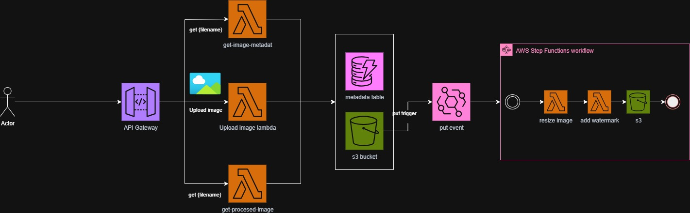
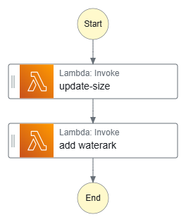

# Serverless Image Processing with S3 and Lambda

**AWS Solutions Architect - Associate Graduation Project**  
**Manara Tech Program**

**Author:** Mohand Ashrf  
**linkedin:** [Mohand Ashrf](https://www.linkedin.com/in/mohand-ashrf/)

---

## 📋 Project Overview

This project implements a **serverless image processing application** on AWS that automatically processes images uploaded to an S3 bucket. The system uses EventBridge and Step Functions to orchestrate a multi-stage image processing pipeline that resizes images and adds watermarks, with full metadata tracking in DynamoDB.

### Architecture Type
**Serverless Event-Driven Architecture**

### Key Features
- ✅ RESTful API for image upload and retrieval
- ✅ Automatic event-driven image processing pipeline
- ✅ Image resizing and watermark application
- ✅ Metadata tracking in DynamoDB
- ✅ Secure API key authentication
- ✅ Cost-efficient and auto-scaling
- ✅ Complete workflow orchestration with Step Functions

---

## 🏗️ Solution Architecture



### Architecture Flow

1. **Image Upload** → User uploads image via API Gateway POST `/upload`
2. **S3 Storage** → Image stored in `uploaded/` prefix in S3 bucket
3. **EventBridge Trigger** → S3 event triggers EventBridge rule on `uploaded/` prefix
4. **Step Functions Orchestration** → EventBridge invokes Step Functions workflow
5. **Lambda Processing Pipeline:**
   - **new-size-image**: Resizes the uploaded image
   - **add-watermark**: Adds watermark to resized image
6. **Final Storage** → Processed image saved to `FINAL-IMAGES/` folder
7. **Metadata Storage** → DynamoDB stores complete image metadata
8. **Image Retrieval** → Users can retrieve images and metadata via API Gateway

### Architecture Components

#### 1. **Amazon API Gateway** (dev stage)
- **Base URL:** `https://4qynjac488.execute-api.us-east-1.amazonaws.com/dev`
- **Rate Limiting:** 10,000 requests/second
- **Burst:** 5,000 requests
- **Security:** API Key authentication (time-limited access)

**API Endpoints:**
| Method | Endpoint | Purpose |
|--------|----------|---------|
| POST | `/upload` | Upload new image |
| GET | `/get-image-metadata/{file-name}` | Retrieve raw uploaded image and metadata |
| GET | `/get-processed-image/{file-name}` | Retrieve processed image and metadata|

#### 2. **AWS Lambda Functions** (Python 3.9)
- **upload-image**: Handles image upload to S3
- **get-image-metadata**: Retrieves raw uploaded image from S3 and metadata from DynamoDB
- **get-processed-image**: Retrieves processed image from S3 and metadata from DynamoDB
- **new-size-image**: Resizes uploaded images
- **add-watermark**: Adds watermark to images

#### 3. **Amazon S3 Bucket** (`mybucketmohand-ashrf`)
- **uploaded/**: Stores original uploaded images
- **FINAL-IMAGES/**: Stores processed images

#### 4. **Amazon EventBridge**
- Monitors S3 events on `uploaded/` prefix
- Triggers Step Functions workflow on new uploads

#### 5. **AWS Step Functions**


Orchestrates the image processing workflow:
```json
{
  "Comment": "Process uploaded image from S3 and save results",
  "StartAt": "update-size",
  "States": {
    "update-size": {
      "Type": "Task",
      "Resource": "arn:aws:lambda:us-east-1:075120018869:function:new-size-image:$LATEST",
      "Next": "add waterark"
    },
    "add waterark": {
      "Type": "Task",
      "Resource": "arn:aws:lambda:us-east-1:075120018869:function:add-watermark:$LATEST",
      "End": true
    }
  }
}
```

#### 6. **Amazon DynamoDB**
**Table Name:** `image-metadata`

**Sample Item Structure:**
```json
{
  "image-id": "upload-20250929_222931-cc1d9991.png",
  "bucket": "mybucketmohand-ashrf",
  "content_type": "image/png",
  "created_date": "2025-09-29T22:29:32.078198",
  "has_transparency": true,
  "height": 859,
  "image_format": "PNG",
  "mode": "RGBA",
  "s3_url": "https://mybucketmohand-ashrf.s3.amazonaws.com/upload-20250929_222931-cc1d9991.png",
  "size_bytes": 1224511,
  "uploaded_at": 1759184972,
  "width": 889
}
```

---

## 🚀 AWS Services Used

| Service | Purpose |
|---------|---------|
| **Amazon S3** | Object storage for original and processed images |
| **AWS Lambda** | Serverless compute for image processing (5 functions) |
| **Amazon API Gateway** | RESTful API with rate limiting and API key auth |
| **AWS Step Functions** | Workflow orchestration for processing pipeline |
| **Amazon EventBridge** | Event routing from S3 to Step Functions |
| **Amazon DynamoDB** | NoSQL database for image metadata |
| **Amazon CloudWatch** | Logging and monitoring |
| **AWS IAM** | Identity and access management |

---
## 🎯 Learning Outcomes

Through this Manara Tech program project, I have learned:

- ✅ Building **event-driven architectures** with EventBridge, Step Functions, and Lambda
- ✅ Designing **RESTful APIs** with API Gateway
- ✅ Implementing **workflow orchestration** using Step Functions
- ✅ Understanding **cost-efficient, auto-scaling** serverless applications
- ✅ Enhancing security using **IAM roles, API keys, and S3 bucket policies**
- ✅ Working with **NoSQL databases** (DynamoDB) for metadata storage
- ✅ Managing AWS resources and deployment
- ✅ Implementing serverless best practices

---

## 💰 Cost Analysis

### Monthly Cost Breakdown (Estimated for 1,000 images/month)

| Service | Usage | Cost |
|---------|-------|------|
| **API Gateway** | 3,000 requests | $0.01 |
| **Lambda Invocations** | 5,000 invocations | $0.10 |
| **Lambda Duration** | 5,000 GB-seconds | $0.83 |
| **Step Functions** | 1,000 state transitions | $0.03 |
| **S3 Storage** | 10 GB storage | $0.23 |
| **S3 Requests** | PUT/GET requests | $0.05 |
| **DynamoDB** | On-Demand, 1K writes, 3K reads | $1.50 |
| **EventBridge** | 1,000 events | $0.00 (Free tier) |
| **CloudWatch Logs** | 1 GB logs | $0.50 |
| **Data Transfer** | 5 GB out | $0.45 |
| **TOTAL** | | **~$3.70/month** |

### Cost Optimization Tips
- ✅ Use S3 Lifecycle policies to archive old images to S3 Glacier
- ✅ Optimize Lambda memory allocation (currently using default)
- ✅ Use DynamoDB on-demand pricing for unpredictable workloads
- ✅ Enable CloudWatch Logs retention policies (7-30 days)
- ✅ Monitor and adjust API Gateway caching if needed
- ✅ Consider using S3 Transfer Acceleration only when needed

**For 10,000 images/month:** ~$25-35/month

📊 [View Detailed Cost Analysis](./docs/cost-analysis.md)

 for ore details visit cost-analysis.md

---

## 📖 How to Use

### 1. Upload an Image

```bash
# Using curl with API key
curl -X POST https://4qynjac488.execute-api.us-east-1.amazonaws.com/dev/upload \
  -H "x-api-key: YOUR_API_KEY" \
  -H "Content-Type: image/png" \
  --data-binary @your-image.png
```

**Response:**
```json
{
  "message": "Image uploaded successfully",
  "image_id": "upload-20250929_222931-cc1d9991.png",
  "s3_url": "https://mybucketmohand-ashrf.s3.amazonaws.com/uploaded/upload-20250929_222931-cc1d9991.png"
}
```

### 2. Get Image Metadata

```bash
curl -X GET https://4qynjac488.execute-api.us-east-1.amazonaws.com/dev/get-image-metadata/upload-20250929_222931-cc1d9991.png \
  -H "x-api-key: YOUR_API_KEY"
```

**Response:**
```json
{
  "image-id": "upload-20250929_222931-cc1d9991.png",
  "width": 889,
  "height": 859,
  "size_bytes": 1224511,
  "content_type": "image/png",
  "has_transparency": true,
  "uploaded_at": 1759184972
}
```

### 3. Get Processed Image

```bash
curl -X GET https://4qynjac488.execute-api.us-east-1.amazonaws.com/dev/get-processed-image/upload-20250929_222931-cc1d9991.png \
  -H "x-api-key: YOUR_API_KEY" \
  --output processed-image.png
```

📖 [View Complete API Documentation](./docs/api-documentation.md)

---

## 🎥 Demo & Videos

### Live Demo
**API Endpoint:** `https://4qynjac488.execute-api.us-east-1.amazonaws.com/dev`  
⚠️ **Note:** API access requires valid API key (time-limited for security)

---

## 🔐 Security Features

1. **API Gateway Security**
   - API Key authentication (time-limited)
   - Rate limiting: 100 req/sec
   - Burst protection: 5,000 requests
   - HTTPS only

2. **IAM Least Privilege**
   - Lambda functions have minimal required permissions
   - Separate execution roles for each function

3. **S3 Security**
   - Block public access enabled

---

## 🚧 Future Enhancements

- [ ] Implement AI-powered image tagging (Amazon Rekognition)
- [ ] Add batch processing for multiple images
- [ ] Create web interface for uploads
- [ ] Implement CDN delivery (CloudFront)
- [ ] Implement facial recognition
- [ ] Add notification system (SNS/SES)

---

## 🙏 Acknowledgments

**Special Thanks:**
- **Ayman Aly Mahmoud** - Course Instructor & Project Mentor
- **Manara Tech** - For providing this amazing learning opportunity
- AWS Community for documentation and best practices

**Program:** AWS Solutions Architect - Associate  
**Platform:** Manara Tech  
**Cohort:** 2025


---

## 📧 Contact

**Mohand Asraf**  
- GitHub: [@mohandasraf](https://github.com/mohandasraf)
- LinkedIn: [Your LinkedIn Profile]
- Email: your.email@example.com

---

## 📄 License

This project is created for educational purposes as part of the Manara Tech AWS Solutions Architect - Associate program.

---